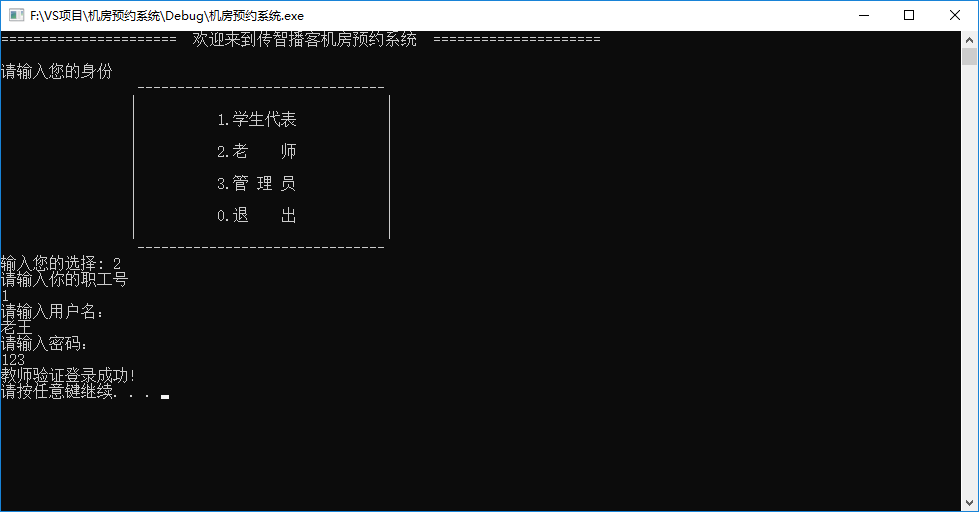

#  登录模块

## 1 全局文件添加

功能描述：

* 不同的身份可能会用到不同的文件操作，我们可以将所有的文件名定义到一个全局的文件中
* 在头文件中添加 **globalFile.h** 文件
* 并添加如下代码：

```C++
#pragma once 

//管理员文件
#define ADMIN_FILE     "admin.txt"
//学生文件
#define STUDENT_FILE   "student.txt"
//教师文件
#define TEACHER_FILE   "teacher.txt"
//机房信息文件
#define COMPUTER_FILE  "computerRoom.txt"
//订单文件
#define ORDER_FILE     "order.txt"
```


并且在同级目录下，创建这几个文件


## 2  登录函数封装

功能描述：

* 根据用户的选择，进入不同的身份登录

在预约系统的.cpp文件中添加全局函数 `void LoginIn(string fileName, int type)`

参数：

* fileName  --- 操作的文件名
* type      ---  登录的身份  （1代表学生、2代表老师、3代表管理员）


LoginIn中添加如下代码：

```C++
#include "globalFile.h"
#include "identity.h"
#include <fstream>
#include <string>


//登录功能
void LoginIn(string fileName, int type)
{

	Identity * person = NULL;

	ifstream ifs;
	ifs.open(fileName, ios::in);

	//文件不存在情况
	if (!ifs.is_open())
	{
		cout << "文件不存在" << endl;
		ifs.close();
		return;
	}

	int id = 0;
	string name;
	string pwd;

	if (type == 1)	//学生登录
	{
		cout << "请输入你的学号" << endl;
		cin >> id;
	}
	else if (type == 2) //教师登录
	{
		cout << "请输入你的职工号" << endl;
		cin >> id;
	}

	cout << "请输入用户名：" << endl;
	cin >> name;

	cout << "请输入密码： " << endl;
	cin >> pwd;


	if (type == 1)
	{
		//学生登录验证
	}
	else if (type == 2)
	{
		//教师登录验证
	}
	else if(type == 3)
	{
		//管理员登录验证
	}
	
	cout << "验证登录失败!" << endl;

	system("pause");
	system("cls");
	return;
}
```

* 在main函数的不同分支中，填入不同的登录接口


## 3 学生登录实现

在student.txt文件中添加两条学生信息，用于测试

添加信息:   

```c++
1 张三 123
2 李四 123456
```

其中：

* 第一列  代表  **学号**
* 第二列  代表  **学生姓名**
* 第三列  代表  **密码**

效果图：


在Login函数的学生分支中加入如下代码，验证学生身份

```C++
		//学生登录验证
		int fId;
		string fName;
		string fPwd;
		while (ifs >> fId && ifs >> fName && ifs >> fPwd)
		{
			if (id == fId && name == fName && pwd == fPwd)
			{
				cout << "学生验证登录成功!" << endl;
				system("pause");
				system("cls");
				person = new Student(id, name, pwd);
				
				return;
			}
		}
```

添加代码效果图


测试：


## 4 教师登录实现

在teacher.txt文件中添加一条老师信息，用于测试

添加信息:   

```c++
1 老王 123
```

其中：

- 第一列  代表  **教师职工编号**
- 第二列  代表  **教师姓名**
- 第三列  代表  **密码**

效果图：


在Login函数的教师分支中加入如下代码，验证教师身份

```c++
		//教师登录验证
		int fId;
		string fName;
		string fPwd;
		while (ifs >> fId && ifs >> fName && ifs >> fPwd)
		{
			if (id == fId && name == fName && pwd == fPwd)
			{
				cout << "教师验证登录成功!" << endl;
				system("pause");
				system("cls");
				person = new Teacher(id, name, pwd);
				return;
			}
		}
```

添加代码效果图


测试：




## 5 管理员登录实现

在admin.txt文件中添加一条管理员信息，由于我们只有一条管理员，因此本案例中没有添加管理员的功能

添加信息:   

```C++
admin 123
```

其中：`admin`代表管理员用户名，`123`代表管理员密码

效果图：


在Login函数的管理员分支中加入如下代码，验证管理员身份

```C++
//管理员登录验证
		string fName;
		string fPwd;
		while (ifs >> fName && ifs >> fPwd)
		{
			if (name == fName && pwd == fPwd)
			{
				cout << "验证登录成功!" << endl;
				//登录成功后，按任意键进入管理员界面
				system("pause");
				system("cls");
				//创建管理员对象
				person = new Manager(name,pwd);
				return;
			}
		}
```

添加效果如图：


测试效果如图：


至此，所有身份的登录功能全部实现！

---
Go to | [Home](./README.md) | [Head](#登录模块) | [设计类<-Prev](./D2_DesignObjects.md) |[Next->管理员模块](./D4_Administrator.md)| 