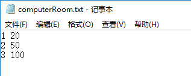
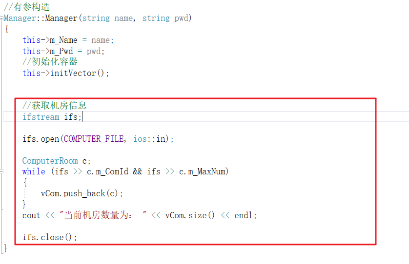
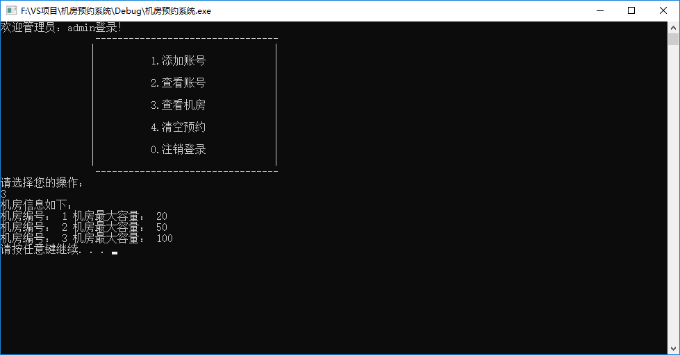

# 管理员模块

## 1  管理员登录和注销

### 1.1 构造函数

* 在Manager类的构造函数中，初始化管理员信息，代码如下：

```C++
//有参构造
Manager::Manager(string name, string pwd)
{
	this->m_Name = name;
	this->m_Pwd = pwd;
}
```

### 1.2  管理员子菜单

* 在机房预约系统.cpp中，当用户登录的是管理员，添加管理员菜单接口
* 将不同的分支提供出来
  * 添加账号
  * 查看账号
  * 查看机房
  * 清空预约
  * 注销登录
* 实现注销功能

添加全局函数 `void managerMenu(Identity * &manager)`，代码如下：

```C++
//管理员菜单
void managerMenu(Identity * &manager)
{
	while (true)
	{
		//管理员菜单
		manager->operMenu();

		Manager* man = (Manager*)manager;
		int select = 0;

		cin >> select;
        
		if (select == 1)  //添加账号
		{
			cout << "添加账号" << endl;
			man->addPerson();
		}
		else if (select == 2) //查看账号
		{
			cout << "查看账号" << endl;
			man->showPerson(); 
		}
		else if (select == 3) //查看机房
		{
			cout << "查看机房" << endl;
			man->showComputer();
		}
		else if (select == 4) //清空预约
		{
			cout << "清空预约" << endl;
			man->cleanFile();
		}
		else
		{
			delete manager;
			cout << "注销成功" << endl;
			system("pause");
			system("cls");
			return;
		}
	}
}
```

### 1.3 菜单功能实现

- 在实现成员函数`void Manager::operMenu()` 代码如下：

```c++
//选择菜单
void Manager::operMenu()
{
	cout << "欢迎管理员："<<this->m_Name << "登录！" << endl;
	cout << "\t\t ---------------------------------\n";
	cout << "\t\t|                                |\n";
	cout << "\t\t|          1.添加账号            |\n";
	cout << "\t\t|                                |\n";
	cout << "\t\t|          2.查看账号            |\n";
	cout << "\t\t|                                |\n";
	cout << "\t\t|          3.查看机房            |\n";
	cout << "\t\t|                                |\n";
	cout << "\t\t|          4.清空预约            |\n";
	cout << "\t\t|                                |\n";
	cout << "\t\t|          0.注销登录            |\n";
	cout << "\t\t|                                |\n";
	cout << "\t\t ---------------------------------\n";
	cout << "请选择您的操作： " << endl;
}
```


### 1.4 接口对接

* 管理员成功登录后，调用管理员子菜单界面
* 在管理员登录验证分支中，添加代码：

```C++
				//进入管理员子菜单
				managerMenu(person);
```

添加效果如：


测试对接，效果如图：


登录成功


注销登录：


至此，管理员身份可以成功登录以及注销


## 2 添加账号 

功能描述：

* 给学生或教师添加新的账号

功能要求：

* 添加时学生学号不能重复、教师职工号不能重复


### 2.1 添加功能实现

在Manager的**addPerson**成员函数中，实现添加新账号功能，代码如下：

```C++
//添加账号  
void Manager::addPerson()
{

	cout << "请输入添加账号的类型" << endl;
	cout << "1、添加学生" << endl;
	cout << "2、添加老师" << endl;

	string fileName;
	string tip;
	ofstream ofs;

	int select = 0;
	cin >> select;

	if (select == 1)
	{
		fileName = STUDENT_FILE;
		tip = "请输入学号： ";
	}
	else
	{
		fileName = TEACHER_FILE;
		tip = "请输入职工编号：";
	}

	ofs.open(fileName, ios::out | ios::app);
	int id;
	string name;
	string pwd;
	cout <<tip << endl;
	cin >> id;

	cout << "请输入姓名： " << endl;
	cin >> name;

	cout << "请输入密码： " << endl;
	cin >> pwd;

	ofs << id << " " << name << " " << pwd << " " << endl;
	cout << "添加成功" << endl;

	system("pause");
	system("cls");

	ofs.close();
}
```


测试添加学生：


成功在学生文件中添加了一条信息


测试添加教师：


成功在教师文件中添加了一条信息


### 2.2 去重操作

功能描述：添加新账号时，如果是重复的学生编号，或是重复的教师职工编号，提示有误

#### 2.2.1 读取信息

* 要去除重复的账号，首先要先将学生和教师的账号信息获取到程序中，方可检测
* 在manager.h中，添加两个容器，用于存放学生和教师的信息
* 添加一个新的成员函数  `void initVector()` 初始化容器

```C++
	//初始化容器
	void initVector();

	//学生容器
	vector<Student> vStu;

	//教师容器
	vector<Teacher> vTea;
```

添加位置如图：


在Manager的有参构造函数中，获取目前的学生和教师信息

代码如下：

```C++
void Manager::initVector()
{
	//读取学生文件中信息
	ifstream ifs;
	ifs.open(STUDENT_FILE, ios::in);
	if (!ifs.is_open())
	{
		cout << "文件读取失败" << endl;
		return;
	}
    
	vStu.clear();
     vTea.clear();
    
	Student s;
	while (ifs >> s.m_Id && ifs >> s.m_Name &&  ifs >> s.m_Pwd)
	{
		vStu.push_back(s);
	}
	cout << "当前学生数量为： " << vStu.size() << endl;
	ifs.close(); //学生初始化

	//读取老师文件信息
	ifs.open(TEACHER_FILE, ios::in);

	Teacher t;
	while (ifs >> t.m_EmpId && ifs >> t.m_Name &&  ifs >> t.m_Pwd)
	{
		vTea.push_back(t);
	}
	cout << "当前教师数量为： " << vTea.size() << endl;

	ifs.close();
}
```


在有参构造函数中，调用初始化容器函数

```C++
//有参构造
Manager::Manager(string name, string pwd)
{
	this->m_Name = name;
	this->m_Pwd = pwd;
    
	//初始化容器
	this->initVector();
}
```


测试，运行代码可以看到测试代码获取当前学生和教师数量


#### 2.2.2 去重函数封装

在manager.h文件中添加成员函数` bool checkRepeat(int id, int type);`

```C++
	//检测重复 参数:(传入id，传入类型) 返回值：(true 代表有重复，false代表没有重复)
	bool checkRepeat(int id, int type);
```


在manager.cpp文件中实现成员函数  ` bool checkRepeat(int id, int type);`

```C++
bool Manager::checkRepeat(int id, int type)
{
	if (type == 1)
	{
		for (vector<Student>::iterator it = vStu.begin(); it != vStu.end(); it++)
		{
			if (id == it->m_Id)
			{
				return true;
			}
		}
	}
	else
	{
		for (vector<Teacher>::iterator it = vTea.begin(); it != vTea.end(); it++)
		{
			if (id == it->m_EmpId)
			{
				return true;
			}
		}
	}
	return false;
}
```


#### 2.2.3 添加去重操作

在添加学生编号或者教师职工号时，检测是否有重复，代码如下：

```C++
	string errorTip; //重复错误提示

	if (select == 1)
	{
		fileName = STUDENT_FILE;
		tip = "请输入学号： ";
		errorTip = "学号重复，请重新输入";
	}
	else
	{
		fileName = TEACHER_FILE;
		tip = "请输入职工编号：";
		errorTip = "职工号重复，请重新输入";
	}
	ofs.open(fileName, ios::out | ios::app);
	int id;
	string name;
	string pwd;
	cout <<tip << endl;

	while (true)
	{
		cin >> id;

		bool ret = this->checkRepeat(id, 1);

		if (ret) //有重复
		{
			cout << errorTip << endl;
		}
		else
		{
			break;
		}
	}
```

代码位置如图：


检测效果：


#### 2.2.4 bug解决

bug描述：

* 虽然可以检测重复的账号，但是刚添加的账号由于没有更新到容器中，因此不会做检测
* 导致刚加入的账号的学生号或者职工编号，再次添加时依然可以重复

解决方案：

* 在每次添加新账号时，重新初始化容器

在添加完毕后，加入代码：

```C++
	//初始化容器
	this->initVector();
```

位置如图：


再次测试，刚加入的账号不会重复添加了！


## 3  显示账号

功能描述：显示学生信息或教师信息


### 3.1 显示功能实现

在Manager的**showPerson**成员函数中，实现显示账号功能，代码如下：

```C++
void printStudent(Student & s)
{
	cout << "学号： " << s.m_Id << " 姓名： " << s.m_Name << " 密码：" << s.m_Pwd << endl;
}
void printTeacher(Teacher & t)
{
	cout << "职工号： " << t.m_EmpId << " 姓名： " << t.m_Name << " 密码：" << t.m_Pwd << endl;
}

void Manager::showPerson()
{
	cout << "请选择查看内容：" << endl;
	cout << "1、查看所有学生" << endl;
	cout << "2、查看所有老师" << endl;

	int select = 0;

	cin >> select;
    
	if (select == 1)
	{
		cout << "所有学生信息如下： " << endl;
		for_each(vStu.begin(), vStu.end(), printStudent);
	}
	else
	{
		cout << "所有老师信息如下： " << endl;
		for_each(vTea.begin(), vTea.end(), printTeacher);
	}
	system("pause");
	system("cls");
}
```

### 3.2 测试

测试查看学生效果


测试查看教师效果


至此，显示账号功能实现完毕


## 4 查看机房

### 4.1 添加机房信息

案例需求中，机房一共有三个，其中1号机房容量20台机器，2号50台，3号100台

我们可以将信息录入到computerRoom.txt中




### 4.2 机房类创建

在头文件下，创建新的文件 computerRoom.h

并添加如下代码：

```C++
#pragma once
#include<iostream>
using namespace std;
//机房类
class ComputerRoom
{
public:

	int m_ComId; //机房id号

	int m_MaxNum; //机房最大容量
};
```


#### 7.4.3 初始化机房信息

在Manager管理员类下，添加机房的容器,用于保存机房信息

```C++
	//机房容器
	vector<ComputerRoom> vCom;
```

在Manager有参构造函数中，追加如下代码，初始化机房信息

```C++
	//获取机房信息
	ifstream ifs;

	ifs.open(COMPUTER_FILE, ios::in);

	ComputerRoom c;
	while (ifs >> c.m_ComId && ifs >> c.m_MaxNum)
	{
		vCom.push_back(c);
	}
	cout << "当前机房数量为： " << vCom.size() << endl;

	ifs.close();
```

位置如图：



因为机房信息目前版本不会有所改动，如果后期有修改功能，最好封装到一个函数中，方便维护


### 4.4 显示机房信息

在Manager类的showComputer成员函数中添加如下代码：

```C++
//查看机房信息
void Manager::showComputer()
{
	cout << "机房信息如下： " << endl;
	for (vector<ComputerRoom>::iterator it = vCom.begin(); it != vCom.end(); it++)
	{
		cout << "机房编号： " << it->m_ComId << " 机房最大容量： " << it->m_MaxNum << endl;
	}
	system("pause");
	system("cls");
}
```

测试显示机房信息功能：




## 5 清空预约

功能描述：

清空生成的`order.txt`预约文件

### 5.1 清空功能实现

在Manager的cleanFile成员函数中添加如下代码：

```C++
//清空预约记录
void Manager::cleanFile()
{
	ofstream ofs(ORDER_FILE, ios::trunc);
	ofs.close();

	cout << "清空成功！" << endl;
	system("pause");
	system("cls");
}
```

测试清空，可以随意写入一些信息在order.txt中，然后调用cleanFile清空文件接口，查看是否清空干净

---
Go to | [Home](./README.md) | [Head](#管理员模块) | [登录模块<-Prev](./D3_Login.md) |[Next->学员模块](./D5_Students.md)| 