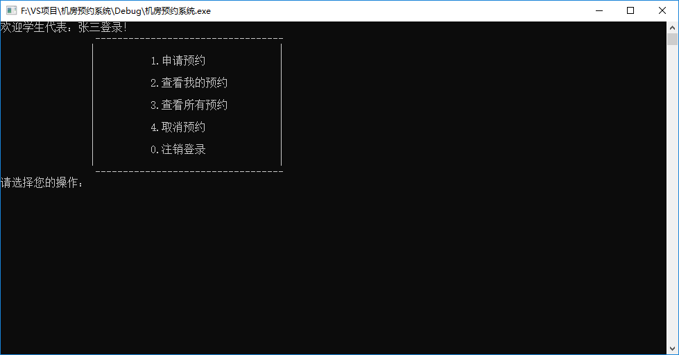
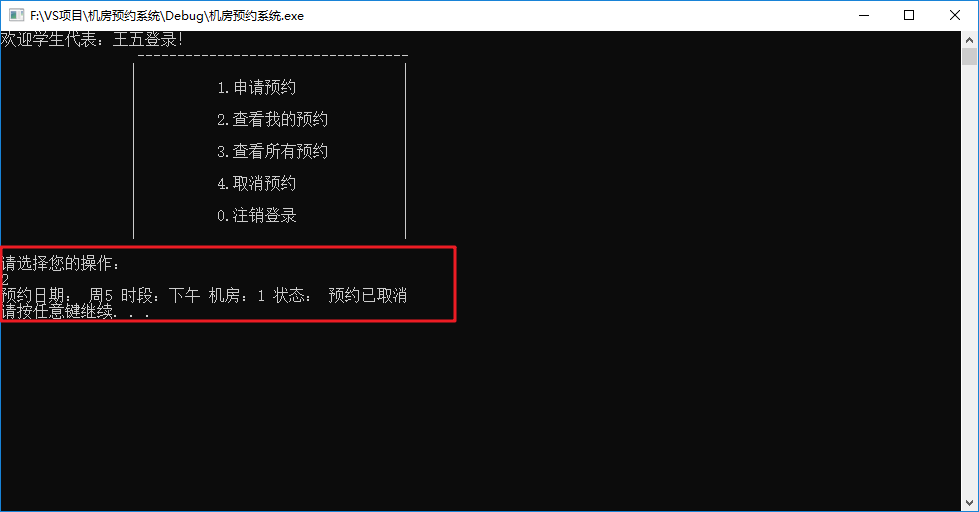

# 学生模块

## 1 学生登录和注销

### 1.1 构造函数

- 在Student类的构造函数中，初始化学生信息，代码如下：

```c++
//有参构造(学号、姓名、密码)
Student::Student(int id, string name, string pwd)
{
	//初始化属性
	this->m_Id = id;
	this->m_Name = name;
	this->m_Pwd = pwd;
}
```


### 1.2  管理员子菜单

- 在机房预约系统.cpp中，当用户登录的是学生，添加学生菜单接口
- 将不同的分支提供出来
  - 申请预约
  - 查看我的预约
  - 查看所有预约
  - 取消预约
  - 注销登录
- 实现注销功能

添加全局函数 `void studentMenu(Identity * &manager)` 代码如下：

```C++
//学生菜单
void studentMenu(Identity * &student)
{
	while (true)
	{
		//学生菜单
		student->operMenu();

		Student* stu = (Student*)student;
		int select = 0;

		cin >> select;

		if (select == 1) //申请预约
		{
			stu->applyOrder();
		}
		else if (select == 2) //查看自身预约
		{
			stu->showMyOrder();
		}
		else if (select == 3) //查看所有预约
		{
			stu->showAllOrder();
		}
		else if (select == 4) //取消预约
		{
			stu->cancelOrder();
		}
		else
		{
			delete student;
			cout << "注销成功" << endl;
			system("pause");
			system("cls");
			return;
		}
	}
}
```


### 1.3 菜单功能实现

- 在实现成员函数`void Student::operMenu()` 代码如下：

```c++
//菜单界面
void Student::operMenu()
{
	cout << "欢迎学生代表：" << this->m_Name << "登录！" << endl;
	cout << "\t\t ----------------------------------\n";
	cout << "\t\t|                                 |\n";
	cout << "\t\t|          1.申请预约              |\n";
	cout << "\t\t|                                 |\n";
	cout << "\t\t|          2.查看我的预约          |\n";
	cout << "\t\t|                                 |\n";
	cout << "\t\t|          3.查看所有预约          |\n";
	cout << "\t\t|                                 |\n";
	cout << "\t\t|          4.取消预约              |\n";
	cout << "\t\t|                                 |\n";
	cout << "\t\t|          0.注销登录              |\n";
	cout << "\t\t|                                 |\n";
	cout << "\t\t ----------------------------------\n";
	cout << "请选择您的操作： " << endl;
}
```


### 1.4 接口对接

- 学生成功登录后，调用学生的子菜单界面
- 在学生登录分支中，添加代码：

```c++
				//进入学生子菜单
				studentMenu(person);
```

添加效果如图：


测试对接，效果如图：

登录验证通过：


学生子菜单：



注销登录：


## 2 申请预约

### 2.1 获取机房信息

* 在申请预约时，学生可以看到机房的信息，因此我们需要让学生获取到机房的信息

在student.h中添加新的成员函数如下：

```C++
	//机房容器
	vector<ComputerRoom> vCom;
```

在学生的有参构造函数中追加如下代码：

```C++
	//获取机房信息
	ifstream ifs;
	ifs.open(COMPUTER_FILE, ios::in);

	ComputerRoom c;
	while (ifs >> c.m_ComId && ifs >> c.m_MaxNum)
	{
		vCom.push_back(c);
	}

	ifs.close();
```

追加位置如图：


至此，vCom容器中保存了所有机房的信息


### 2.2 预约功能实现

在student.cpp中实现成员函数 `void Student::applyOrder()`

```C++
//申请预约
void Student::applyOrder()
{
	cout << "机房开放时间为周一至周五！" << endl;
	cout << "请输入申请预约的时间：" << endl;
	cout << "1、周一" << endl;
	cout << "2、周二" << endl;
	cout << "3、周三" << endl;
	cout << "4、周四" << endl;
	cout << "5、周五" << endl;
	int date = 0;
	int interval = 0;
	int room = 0;

	while (true)
	{
		cin >> date;
		if (date >= 1 && date <= 5)
		{
			break;
		}
		cout << "输入有误，请重新输入" << endl;
	}


	cout << "请输入申请预约的时间段：" << endl;
	cout << "1、上午" << endl;
	cout << "2、下午" << endl;

	while (true)
	{
		cin >> interval;
		if (interval >= 1 && interval <= 2)
		{
			break;
		}
		cout << "输入有误，请重新输入" << endl;
	}

	cout << "请选择机房：" << endl;
	cout << "1号机房容量：" << vCom[0].m_MaxNum << endl;
	cout << "2号机房容量：" << vCom[1].m_MaxNum << endl;
	cout << "3号机房容量：" << vCom[2].m_MaxNum << endl;

	while (true)
	{
		cin >> room;
		if (room >= 1 && room <= 3)
		{
			break;
		}
		cout << "输入有误，请重新输入" << endl;
	}

	cout << "预约成功！审核中" << endl;

	ofstream ofs(ORDER_FILE, ios::app);
	ofs << "date:" << date << " ";
	ofs << "interval:" << interval << " ";
	ofs << "stuId:" << this->m_Id << " ";
	ofs << "stuName:" << this->m_Name << " ";
	ofs << "roomId:" << room << " ";
	ofs << "status:" << 1 << endl;

	ofs.close();

	system("pause");
	system("cls");
}
```


运行程序，测试代码:


在order.txt文件中生成如下内容：


## 3 显示预约

### 3.1 创建预约类

功能描述：显示预约记录时，需要从文件中获取到所有记录，用来显示，创建预约的类来管理记录以及更新

在头文件以及源文件下分别创建**orderFile.h** 和 **orderFile.cpp**文件

orderFile.h中添加如下代码：

```C++
#pragma once
#include<iostream>
using namespace std;
#include <map>
#include "globalFile.h"

class OrderFile
{
public:

	//构造函数
	OrderFile();

	//更新预约记录
	void updateOrder();

	//记录的容器  key --- 记录的条数  value --- 具体记录的键值对信息
	map<int, map<string, string>> m_orderData;

	//预约记录条数
	int m_Size;
};
```


**构造函数**中获取所有信息，并存放在容器中，添加如下代码：

```C++
OrderFile::OrderFile()
{
	ifstream ifs;
	ifs.open(ORDER_FILE, ios::in);

	string date;      //日期
	string interval;  //时间段
	string stuId;     //学生编号
	string stuName;   //学生姓名
	string roomId;    //机房编号
	string status;    //预约状态


	this->m_Size = 0; //预约记录个数

	while (ifs >> date && ifs >> interval && ifs >> stuId && ifs >> stuName && ifs >> roomId &&  ifs >> status)
	{
		//测试代码
		/*
		cout << date << endl;
		cout << interval << endl;
		cout << stuId << endl;
		cout << stuName << endl;
		cout << roomId << endl;
		cout << status << endl;
		*/

		string key;
		string value;
		map<string, string> m;

		int pos = date.find(":");
		if (pos != -1)
		{
			key = date.substr(0, pos);
			value = date.substr(pos + 1, date.size() - pos -1);
			m.insert(make_pair(key, value));
		}

		pos = interval.find(":");
		if (pos != -1)
		{
			key = interval.substr(0, pos);
			value = interval.substr(pos + 1, interval.size() - pos -1 );
			m.insert(make_pair(key, value));
		}

		pos = stuId.find(":");
		if (pos != -1)
		{
			key = stuId.substr(0, pos);
			value = stuId.substr(pos + 1, stuId.size() - pos -1 );
			m.insert(make_pair(key, value));
		}

		pos = stuName.find(":");
		if (pos != -1)
		{
			key = stuName.substr(0, pos);
			value = stuName.substr(pos + 1, stuName.size() - pos -1);
			m.insert(make_pair(key, value));
		}

		pos = roomId.find(":");
		if (pos != -1)
		{
			key = roomId.substr(0, pos);
			value = roomId.substr(pos + 1, roomId.size() - pos -1 );
			m.insert(make_pair(key, value));
		}

		pos = status.find(":");
		if (pos != -1)
		{
			key = status.substr(0, pos);
			value = status.substr(pos + 1, status.size() - pos -1);
			m.insert(make_pair(key, value));
		}


		this->m_orderData.insert(make_pair(this->m_Size, m));
		this->m_Size++;
	}

	//测试代码
	//for (map<int, map<string, string>>::iterator it = m_orderData.begin(); it != m_orderData.end();it++)
	//{
	//	cout << "key = " << it->first << " value = " << endl;
	//	for (map<string, string>::iterator mit = it->second.begin(); mit != it->second.end(); mit++)
	//	{
	//		cout << mit->first << " " << mit->second << " ";
	//	}
	//	cout << endl;
	//}
    
    ifs.close();
}

```


更新预约记录的成员函数updateOrder代码如下：

```C++
void OrderFile::updateOrder()
{
	if (this->m_Size == 0)
	{
		return;
	}

	ofstream ofs(ORDER_FILE, ios::out | ios::trunc);
	for (int i = 0; i < m_Size;i++)
	{
		ofs << "date:" << this->m_orderData[i]["date"] << " ";
		ofs << "interval:" << this->m_orderData[i]["interval"] << " ";
		ofs << "stuId:" << this->m_orderData[i]["stuId"] << " ";
		ofs << "stuName:" << this->m_orderData[i]["stuName"] << " ";
		ofs << "roomId:" << this->m_orderData[i]["roomId"] << " ";
		ofs << "status:" << this->m_orderData[i]["status"] << endl;
	}
    ofs.close();
}
```


#### 8.3.2 显示自身预约

首先我们先添加几条预约记录，可以用程序添加或者直接修改order.txt文件

order.txt文件内容如下： 比如我们有三名同学分别产生了3条预约记录


在Student类的`void Student::showMyOrder()`成员函数中，添加如下代码

```C++
//查看我的预约
void Student::showMyOrder()
{
	OrderFile of;
	if (of.m_Size == 0)
	{
		cout << "无预约记录" << endl;
		system("pause");
		system("cls");
		return;
	}
	for (int i = 0; i < of.m_Size; i++)
	{
		if (atoi(of.m_orderData[i]["stuId"].c_str()) == this->m_Id)
		{
			cout << "预约日期： 周" << of.m_orderData[i]["date"];
			cout << " 时段：" << (of.m_orderData[i]["interval"] == "1" ? "上午" : "下午");
			cout << " 机房：" << of.m_orderData[i]["roomId"];
			string status = " 状态： ";  // 0 取消的预约   1 审核中   2 已预约 -1 预约失败
			if (of.m_orderData[i]["status"] == "1")
			{
				status += "审核中";
			}
			else if (of.m_orderData[i]["status"] == "2")
			{
				status += "预约成功";
			}
			else if (of.m_orderData[i]["status"] == "-1")
			{
				status += "审核未通过，预约失败";
			}
			else
			{
				status += "预约已取消";
			}
			cout << status << endl;

		}
	}

	system("pause");
	system("cls");
}
```

测试效果如图：


### 3.3 显示所有预约

在Student类的`void Student::showAllOrder()`成员函数中，添加如下代码

```C++
//查看所有预约
void Student::showAllOrder()
{
	OrderFile of;
	if (of.m_Size == 0)
	{
		cout << "无预约记录" << endl;
		system("pause");
		system("cls");
		return;
	}

	for (int i = 0; i < of.m_Size; i++)
	{
		cout << i + 1 << "、 ";

		cout << "预约日期： 周" << of.m_orderData[i]["date"];
		cout << " 时段：" << (of.m_orderData[i]["interval"] == "1" ? "上午" : "下午");
		cout << " 学号：" << of.m_orderData[i]["stuId"];
		cout << " 姓名：" << of.m_orderData[i]["stuName"];
		cout << " 机房：" << of.m_orderData[i]["roomId"];
		string status = " 状态： ";  // 0 取消的预约   1 审核中   2 已预约 -1 预约失败
		if (of.m_orderData[i]["status"] == "1")
		{
			status += "审核中";
		}
		else if (of.m_orderData[i]["status"] == "2")
		{
			status += "预约成功";
		}
		else if (of.m_orderData[i]["status"] == "-1")
		{
			status += "审核未通过，预约失败";
		}
		else
		{
			status += "预约已取消";
		}
		cout << status << endl;
	}

	system("pause");
	system("cls");
}
```

测试效果如图：


## 4 取消预约

在Student类的`void Student::cancelOrder()`成员函数中，添加如下代码

```C++
//取消预约
void Student::cancelOrder()
{
	OrderFile of;
	if (of.m_Size == 0)
	{
		cout << "无预约记录" << endl;
		system("pause");
		system("cls");
		return;
	}
	cout << "审核中或预约成功的记录可以取消，请输入取消的记录" << endl;

	vector<int>v;
	int index = 1;
	for (int i = 0; i < of.m_Size; i++)
	{
		if (atoi(of.m_orderData[i]["stuId"].c_str()) == this->m_Id)
		{
			if (of.m_orderData[i]["status"] == "1" || of.m_orderData[i]["status"] == "2")
			{
				v.push_back(i);
				cout <<  index ++  << "、 ";
				cout << "预约日期： 周" << of.m_orderData[i]["date"];
				cout << " 时段：" << (of.m_orderData[i]["interval"] == "1" ? "上午" : "下午");
				cout << " 机房：" << of.m_orderData[i]["roomId"];
				string status = " 状态： ";  // 0 取消的预约   1 审核中   2 已预约  -1 预约失败
				if (of.m_orderData[i]["status"] == "1")
				{
					status += "审核中";
				}
				else if (of.m_orderData[i]["status"] == "2")
				{
					status += "预约成功";
				}
				cout << status << endl;

			}
		}
	}

	cout << "请输入取消的记录,0代表返回" << endl;
	int select = 0;
	while (true)
	{
		cin >> select;
		if (select >= 0 && select <= v.size())
		{
			if (select == 0)
			{
				break;
			}
			else
			{
				//	cout << "记录所在位置： " << v[select - 1] << endl;
				of.m_orderData[v[select - 1]]["status"] = "0";
				of.updateOrder();
				cout << "已取消预约" << endl;
				break;
			}

		}
		cout << "输入有误，请重新输入" << endl;
	}

	system("pause");
	system("cls");
}

```

测试取消预约：


再次查看个人预约记录：



查看所有预约


查看order.txt预约文件


至此，学生模块功能全部实现

---
Go to | [Home](./README.md) | [Head](#学生模块) | [管理员模块<-Prev](./D4_Administrator.md) |[Next->教师模块](./D6_Teachers.md)| 