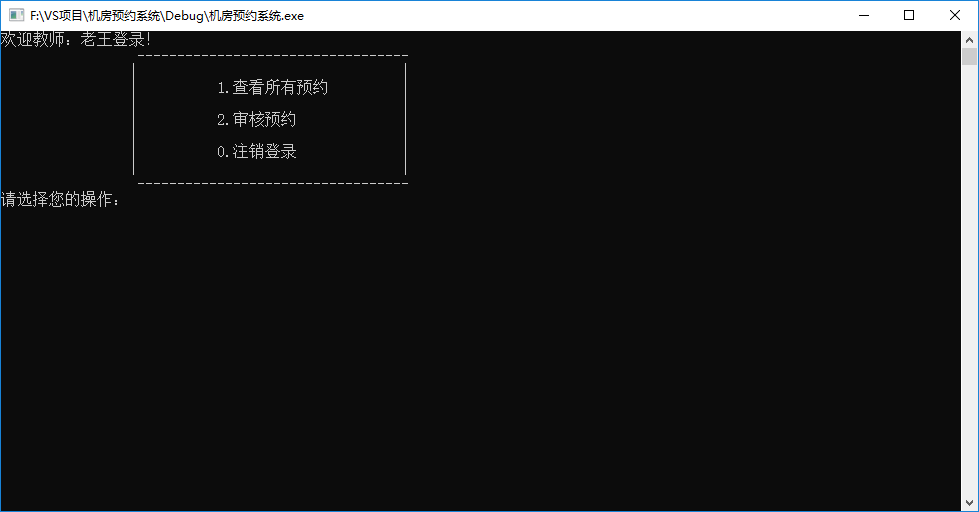

# 教师模块

## 1 教师登录和注销

### 1.1 构造函数

- 在Teacher类的构造函数中，初始化教师信息，代码如下：

```c++
//有参构造 (职工编号，姓名，密码)
Teacher::Teacher(int empId, string name, string pwd)
{
	//初始化属性
	this->m_EmpId = empId;
	this->m_Name = name;
	this->m_Pwd = pwd;
}
```

### 1.2  教师子菜单

- 在机房预约系统.cpp中，当用户登录的是教师，添加教师菜单接口
- 将不同的分支提供出来
  - 查看所有预约
  - 审核预约
  - 注销登录
- 实现注销功能

添加全局函数 `void TeacherMenu(Person * &manager)` 代码如下：

```c++
//教师菜单
void TeacherMenu(Identity * &teacher)
{
	while (true)
	{
		//教师菜单
		teacher->operMenu();

		Teacher* tea = (Teacher*)teacher;
		int select = 0;

		cin >> select;

		if (select == 1)
		{
			//查看所有预约
			tea->showAllOrder();
		}
		else if (select == 2)
		{
			//审核预约
			tea->validOrder();
		}
		else
		{
			delete teacher;
			cout << "注销成功" << endl;
			system("pause");
			system("cls");
			return;
		}

	}
}
```


### 1.3 菜单功能实现

- 在实现成员函数`void Teacher::operMenu()` 代码如下：

```c++
//教师菜单界面
void Teacher::operMenu()
{
	cout << "欢迎教师：" << this->m_Name << "登录！" << endl;
	cout << "\t\t ----------------------------------\n";
	cout << "\t\t|                                  |\n";
	cout << "\t\t|          1.查看所有预约          |\n";
	cout << "\t\t|                                  |\n";
	cout << "\t\t|          2.审核预约              |\n";
	cout << "\t\t|                                  |\n";
	cout << "\t\t|          0.注销登录              |\n";
	cout << "\t\t|                                  |\n";
	cout << "\t\t ----------------------------------\n";
	cout << "请选择您的操作： " << endl;
}
```


### 1.4 接口对接

- 教师成功登录后，调用教师的子菜单界面
- 在教师登录分支中，添加代码：

```c++
				//进入教师子菜单
				TeacherMenu(person);
```

添加效果如图：


测试对接，效果如图：

登录验证通过：


教师子菜单：



注销登录：


## 2 查看所有预约

### 2.1 所有预约功能实现

该功能与学生身份的查看所有预约功能相似，用于显示所有预约记录

在Teacher.cpp中实现成员函数 `void Teacher::showAllOrder()`

```C++
void Teacher::showAllOrder()
{
	OrderFile of;
	if (of.m_Size == 0)
	{
		cout << "无预约记录" << endl;
		system("pause");
		system("cls");
		return;
	}
	for (int i = 0; i < of.m_Size; i++)
	{
		cout << i + 1 << "、 ";

		cout << "预约日期： 周" << of.m_orderData[i]["date"];
		cout << " 时段：" << (of.m_orderData[i]["interval"] == "1" ? "上午" : "下午");
		cout << " 学号：" << of.m_orderData[i]["stuId"];
		cout << " 姓名：" << of.m_orderData[i]["stuName"];
		cout << " 机房：" << of.m_orderData[i]["roomId"];
		string status = " 状态： ";  // 0 取消的预约   1 审核中   2 已预约 -1 预约失败
		if (of.m_orderData[i]["status"] == "1")
		{
			status += "审核中";
		}
		else if (of.m_orderData[i]["status"] == "2")
		{
			status += "预约成功";
		}
		else if (of.m_orderData[i]["status"] == "-1")
		{
			status += "审核未通过，预约失败";
		}
		else
		{
			status += "预约已取消";
		}
		cout << status << endl;
	}

	system("pause");
	system("cls");
}
```


### 2.2 测试功能

运行测试教师身份的查看所有预约功能

测试效果如图：


## 3 审核预约

### 3.1 审核功能实现

功能描述：教师审核学生的预约，依据实际情况审核预约

在Teacher.cpp中实现成员函数 `void Teacher::validOrder()`

代码如下：

```C++
//审核预约
void Teacher::validOrder()
{
	OrderFile of;
	if (of.m_Size == 0)
	{
		cout << "无预约记录" << endl;
		system("pause");
		system("cls");
		return;
	}
	cout << "待审核的预约记录如下：" << endl;

	vector<int>v;
	int index = 0;
	for (int i = 0; i < of.m_Size; i++)
	{
		if (of.m_orderData[i]["status"] == "1")
		{
			v.push_back(i);
			cout << ++index << "、 ";
			cout << "预约日期： 周" << of.m_orderData[i]["date"];
			cout << " 时段：" << (of.m_orderData[i]["interval"] == "1" ? "上午" : "下午");
			cout << " 机房：" << of.m_orderData[i]["roomId"];
			string status = " 状态： ";  // 0取消的预约   1 审核中   2 已预约  -1 预约失败
			if (of.m_orderData[i]["status"] == "1")
			{
				status += "审核中";
			}
			cout << status << endl;
		}
	}
	cout << "请输入审核的预约记录,0代表返回" << endl;
	int select = 0;
	int ret = 0;
	while (true)
	{
		cin >> select;
		if (select >= 0 && select <= v.size())
		{
			if (select == 0)
			{
				break;
			}
			else
			{
				cout << "请输入审核结果" << endl;
				cout << "1、通过" << endl;
				cout << "2、不通过" << endl;
				cin >> ret;

				if (ret == 1)
				{
					of.m_orderData[v[select - 1]]["status"] = "2";
				}
				else
				{
					of.m_orderData[v[select - 1]]["status"] = "-1";
				}
				of.updateOrder();
				cout << "审核完毕！" << endl;
				break;
			}
		}
		cout << "输入有误，请重新输入" << endl;
	}

	system("pause");
	system("cls");
}
```

### 3.2 测试审核预约

测试 - 审核通过


审核通过情况


测试-审核未通过


审核未通过情况：


学生身份下查看记录：


审核预约成功！

---
Go to | [Home](./README.md) | [Head](#教师模块) | [学生模块<-Prev](./D5_Students.md) |[Next->GUI设计](./D7_DesignGUI.md)| 