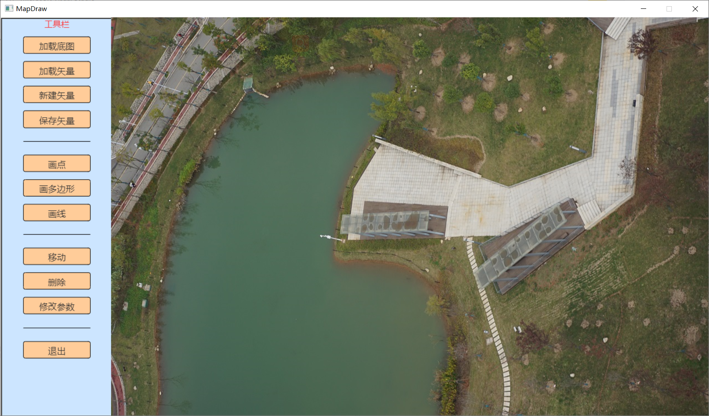

# 程序主框架

[TOC]

使用EasyX可以在控制台程序中显示图像、绘制图形，让程序变得更为美观。基于此，可以把程序界面设置为控制按钮+图形显示的形式。
## 内容简介
- 使用EasyX加载程序界面
- 监听鼠标消息
- 根据鼠标位置判断被点击的控件- 

## 1. 主界面
- 程序演示视频链接 [MapDraw_Introduction](https://www.bilibili.com/video/BV1ob4y1r7N9)

<iframe src="//player.bilibili.com/player.html?aid=631568297&bvid=BV1ob4y1r7N9&cid=367797257&page=1" scrolling="no" border="0" frameborder="no" framespacing="0" allowfullscreen="true"> </iframe>

<!---->

主界面由两张图片构成，左侧的工具栏为图片，右侧为加载的底图。

- 示例代码为：
```c++
#include <graphics.h>	//EasyX
#include <conio.h>		//_getch

void loadImageUI();	//前向声明，加载UI

//主函数
int main()
{
	initgraph(1280, 720);

	loadImageUI();

	Commander	cmder;
	cmder.Run();

	closegraph();

	return 0;
}

// 加载UI
void loadImageUI()
{
	IMAGE	img_bg;
	IMAGE	img_menu;

	loadimage(&img_bg, "C:\\Users\\wanghp\\Desktop\\image.jpg");
	loadimage(&img_menu, "C:\\Users\\wanghp\\Desktop\\MapDraw_UI.png");

	putimage(200, 0, &img_bg);
	putimage(0, 0, &img_menu);
}
```

## 2. 如何响应按钮消息

当鼠标在工具栏图片对应按钮位置单击时，需要响应对应的功能。其实现思路是：

### 2.1.监听鼠标消息

以下代码监听了鼠标消息，当鼠标左键按下时，弹出一个消息框；当鼠标右键抬起时，退出程序。

```c++
int main()
{
    initgraph(1280, 720);
	
	//加载图片
	loadImageUI();

	MOUSEMSG msg;		//定义变量，保存鼠标消息
	FlushMouseMsgBuffer();// 清空鼠标消息缓冲区，避免无效鼠标信息带入到正式判断中
	bool	bExit = false;	//是否退出的标志
	
	while (!bExit)	//一直循环
	{
		while (MouseHit())	//检查鼠标消息
		{
			msg = GetMouseMsg();	//鼠标消息状态
			switch (msg.uMsg)
			{
			case WM_LBUTTONDOWN:	//左键按下
				MessageBox(GetHWnd(), "LButtonDown", "Info", MB_ICONINFORMATION);
				break;
			case WM_RBUTTONUP:		//右键抬起
				bExit = true;	//退出程序标记
				break;
			default:
				Sleep(10);	//休眠10ms
				break;
			}
	
			if (bExit) break;	//退出循环
		}
	}
	
	closegraph();
	
	return 0;
}
```

### 2. 根据鼠标消息的位置，判断单击的是哪个按钮

在WM_LBUTTONDOWN分支中，根据鼠标按钮的位置，来判断鼠标位置，返回鼠标所在控件编号。
```c++
int main()
{
	// 省略代码...
	while (!bExit)	//一直循环
	{
		while (MouseHit())	//检查鼠标消息
		{
			msg = GetMouseMsg();	//鼠标消息状态
			switch (msg.uMsg)
			{
			case WM_LBUTTONDOWN:	//左键按下
				if (x <= 160 && x >= 40)	//左侧按钮
				{
					if (y >= 35 && y <= 65)	MessageBox(GetHWnd(), "Load Image", "Info", MB_ICONINFORMATION);
					else if (y >= 80 && y <= 110) MessageBox(GetHWnd(), "Load Vector", "Info", MB_ICONINFORMATION);
					else if (y >= 125 && y <= 155) MessageBox(GetHWnd(), "New Vector", "Info", MB_ICONINFORMATION);
					// 根据鼠标位置，执行相应的函数...
				}
				break;
			
			// 省略...
			}
	
			if (bExit) break;	//退出循环
		}
	}
	
	// 省略...
}
```
## 3. 小结
至此程序的主框架已完成。程序实现了鼠标在左侧Menu图片上左键单击时，可以根据鼠标位置判断鼠标点击的是哪个按钮，响应对应的处理函数。

___

Goto | [Home](../README.md) | [Head](#程序主框架) | [MouseMsg->Next](./D2_MouseMsg.md) | [EasyX<-Prev](./D0_EasyX.md) |


