# RSCmd Manual

## 0. 操作视频
- [01.MainFrame](../../videos/01.RSCmd_MainFrame.avi)
- [02.OpenData](../../videos/02.RSCmd_OpenData.avi)
- [02-1.Open](02.RSCmd_2_Open.avi)
- [03.Display](03.RSCmd_Display.avi)

## 1. Introduction RSCmd and Data

- RSCmd.rar

> 压缩包，包含着RSCmd.exe和数据test.hdr, test.img。

- RSCmd.exe

> 可执行程序，即源代码编译链接后的输出结果。

- test.hdr

> 图像元数据文件，描述图像数据的数据，是ASCII文件，用记事本(notepad)或Notepad++，EditPlus等工具打开即可看到相关内容。打开示意图如下：

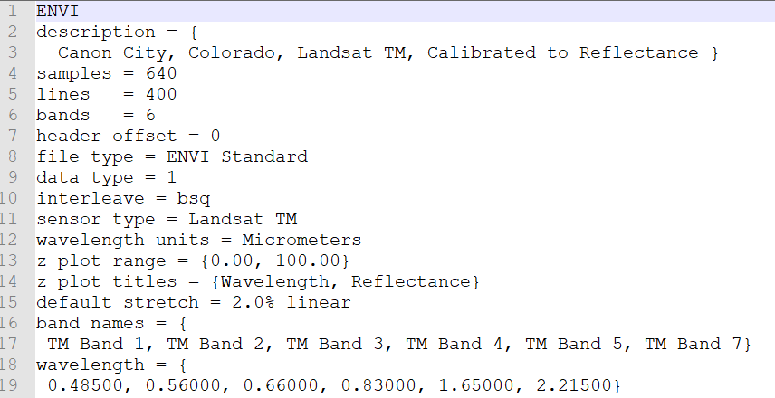

- test.img

> 图像数据文件，图像二进制流，按照排列顺序，一个一个像素顺序排列的文件。

## 2. How to Execute RSCmd

- Win+R - Windows图标+R

弹出运行框，输入cmd，执行，弹出控制台窗口

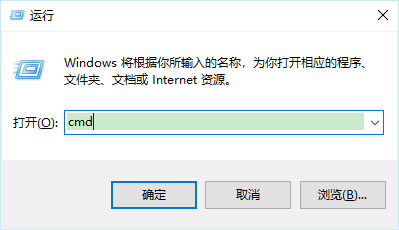

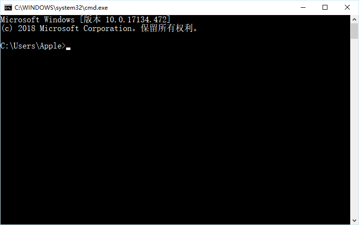

- Execute RSCmd

> 输入如下的命令行，即可启动程序

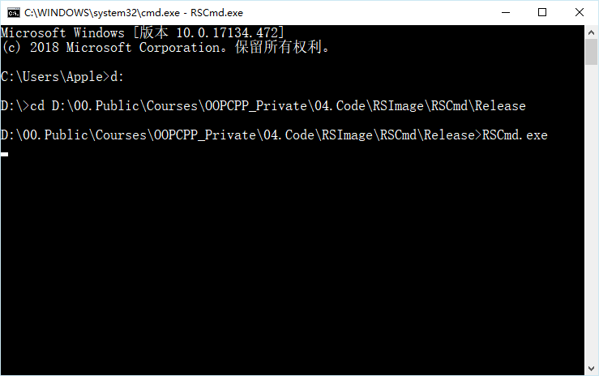

- RSCmd.exe

> 程序界面如下：

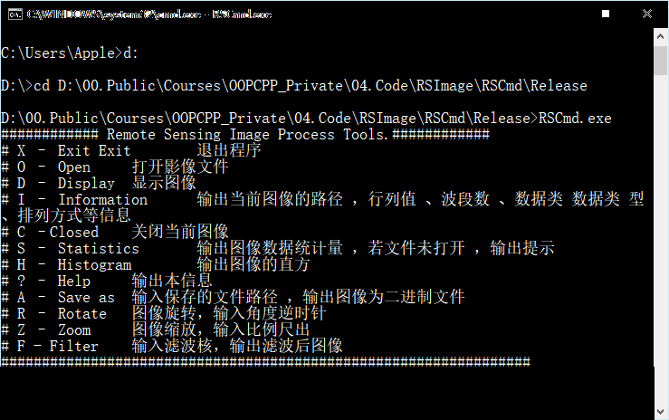

## 3. Command Line

### 3.1 Open

- Open Command

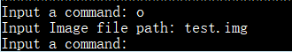

### 3.2 Statistics

- Command Line

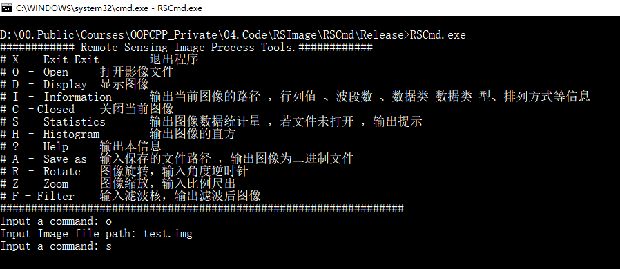

- Output

### 3.3 Histogram

- Command Line

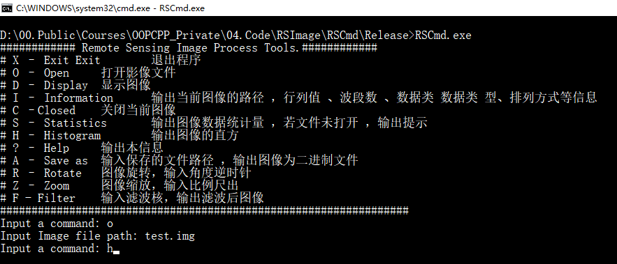

- Output Histogram

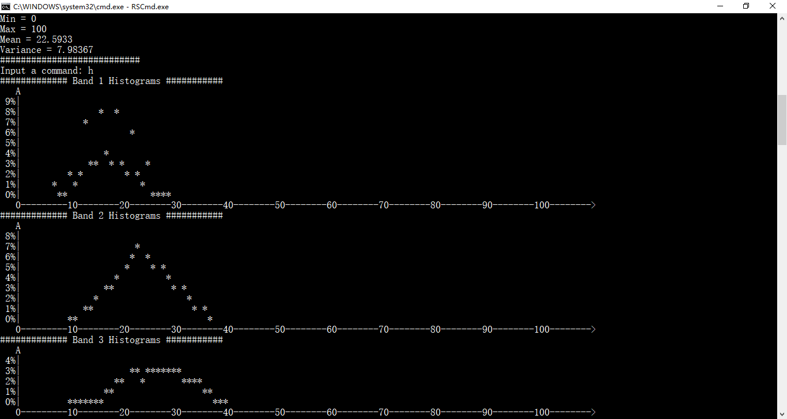

### 3.4 Display

- Command Line

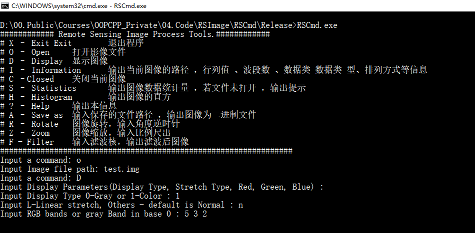

- Output Image:

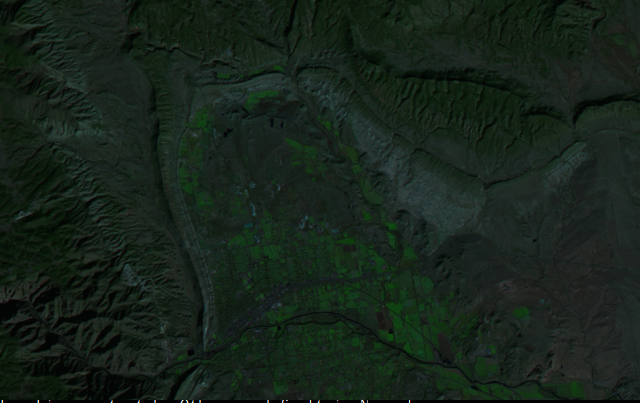

- Linear Stretch

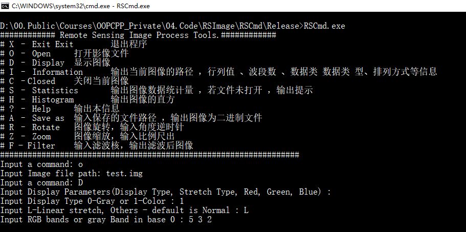

- Linear stretch Display

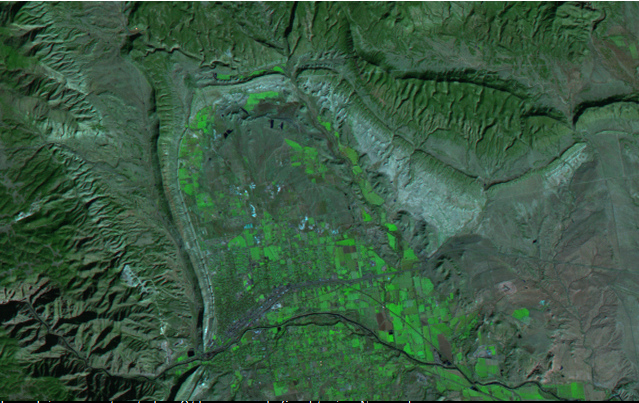

- Gray Display Command Line

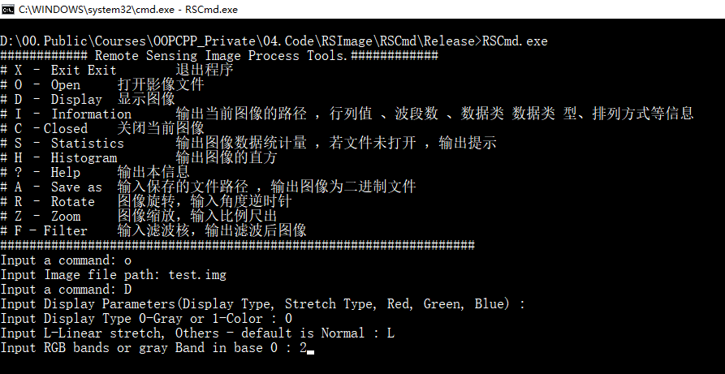

- Output: Gray Display

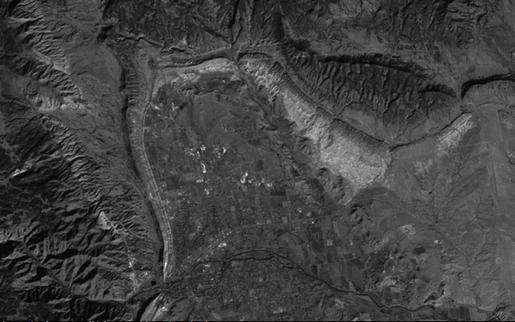

- **试着改变波段组合，显示不同的伪彩色图像**

### 3.5 Filter

- Filter Command Line

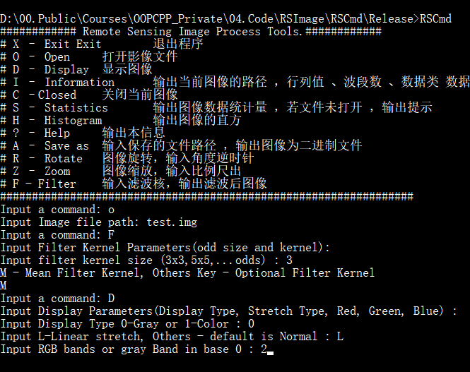

- Image Filtered

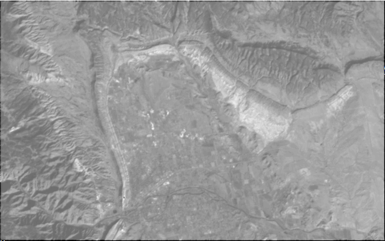

- **试着改变滤波核的大小，看看图像会有哪些变化。**

- 自定义滤波

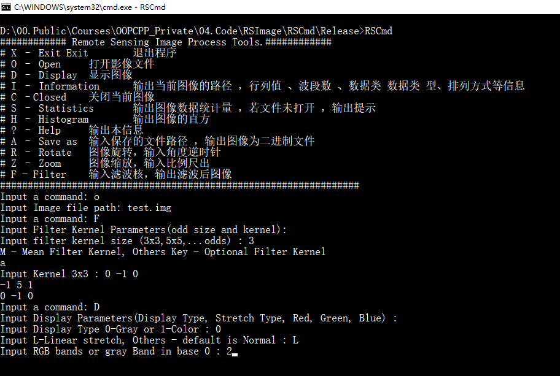

- Image Filtered

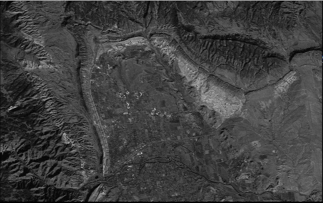

- **自定义输入滤波核，观察图像的变化！**

